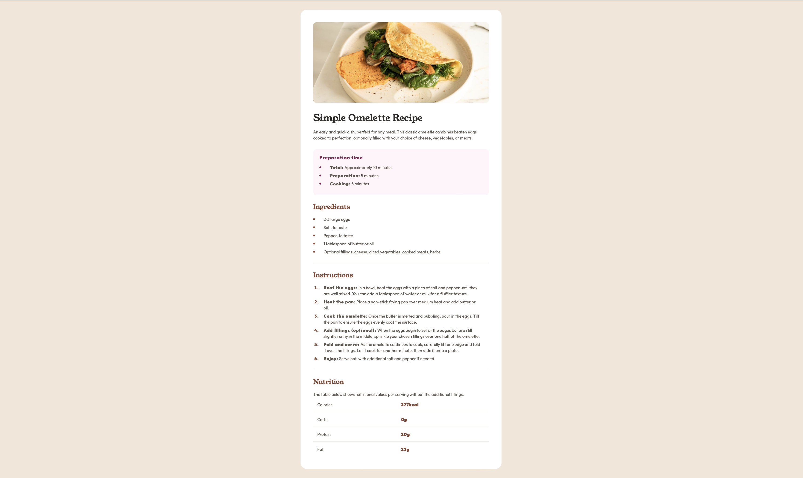

# Frontend Mentor - Recipe page solution

This is a solution to the [Recipe page challenge on Frontend Mentor](https://www.frontendmentor.io/challenges/recipe-page-KiTsR8QQKm). Frontend Mentor challenges help you improve your coding skills by building realistic projects. 

## Table of contents

- [Overview](#overview)
  - [Screenshot](#screenshot)
  - [Links](#links)
- [My process](#my-process)
  - [Built with](#built-with)
  - [What I learned](#what-i-learned)
  - [Continued development](#continued-development)
- [Author](#author)

## Overview

### Screenshot



### Links

- Solution URL: [https://github.com/hackz101/recipe-page-main](https://github.com/hackz101/recipe-page-main)
- Live Site URL: [https://recipe-page-main-hackz101s-projects.vercel.app](https://recipe-page-main-hackz101s-projects.vercel.app)

## My process

### Built with

- Semantic HTML5 markup
- CSS custom properties
- CSS Grid
- Responsive workflow

### What I learned

While going through this challenge, I found out a few things that I previously didn't know about modern HTML and CSS:

1. You can center an element within a container by making the parent a grid and not giving any columns.

```html
<main class="container">
    <div class="recipe-wrapper">
      ...
    </div>
</main>
```
```css
.container {
  display: grid;
  place-items: center;
}
```

### Continued development

For future projects, I want to focus on the following things:

- Developing with responsive design from the start
- Getting comfortable using non-fixed sizing

## Author

- Frontend Mentor - [@hackz101](https://www.frontendmentor.io/profile/hackz101)